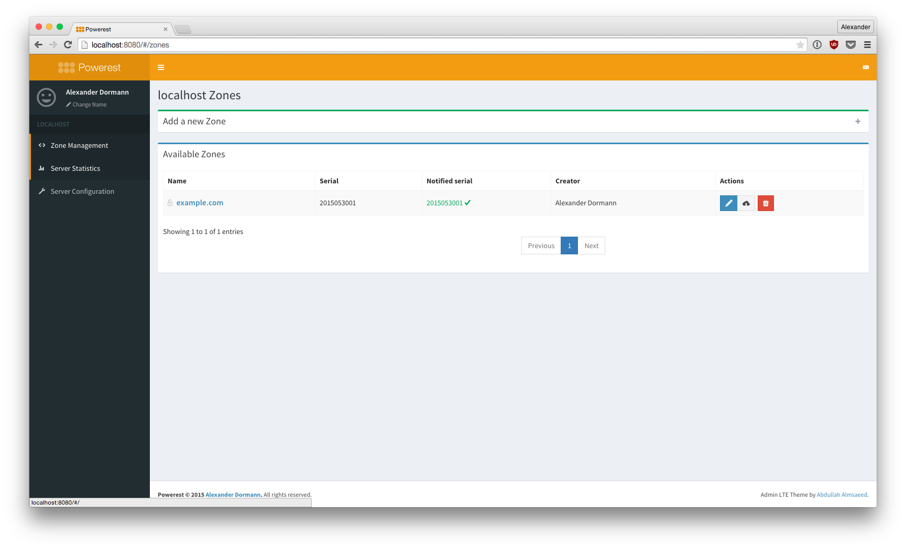
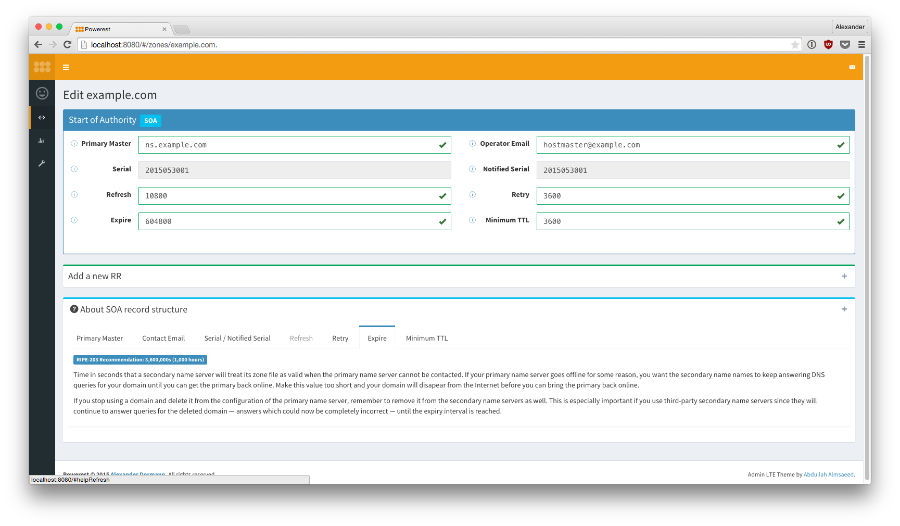
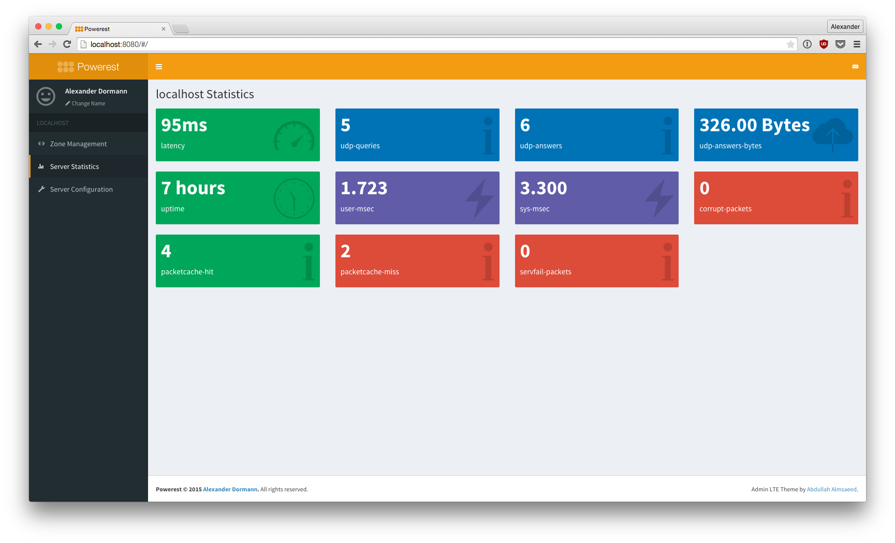
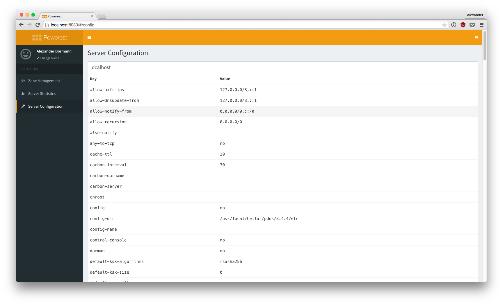

# Powerest

Powerest is a React.js-based frontend for the rest(ful) PowerDNS web API.

## State of Development

Powerest is currently under heavy development and nowhere near a productive release. The software
 is highly unstable and should not be used in any other environment than a sandbox.

### Development Progress

Here's a brief overview of what Powerest is already/will be capable of. 

- [x] single server configuration 
- [x] basic server statistics
- [x] zone overview
- [x] zone creation
- [x] zone deletion
- [x] manually trigger zone notify
- [x] zone details
- [ ] zone soa edit
- [x] record creation
- [ ] record modification
- [ ] record deletion
- [ ] automatically increase SOA on edit
- [x] notification system
- [ ] alert system
- [ ] record grouping and tagging (local storage)
- [ ] multiserver config
- [ ] also work for pdns slaves
- [ ] proper frontend validation (IPv4, IPv6, CNAMEs, etc)

## Set-Up

1. Stop here if you want to use Powerest as a frontend for slaves. It's NYI.
2. Make sure your PowerDNS configuration contains the following:

        webserver=yes
        experimental-json-interface=yes
        experimental-api-key=YOUR_API_KEY

3. Checkout the Powerest repository to a location which is reachable via your web browser. 
   It's document root should be `public/`. Powerest is a plain HTML-, CSS- and JS-based 
   application, so you won't need to configure a database.
   
4. Set-Up some HTTP Basic/Digest auth for your vhost or ensure Powerest is only available 
   within a private network.
   
5. Copy the `public/app/config.js.dist` to `public/app/config.js` and adjust it's values. 
   **Important:** Check whether Powerest is really limited to an internal network / secured 
   via Auth before you stick your API key in there!

6. Run `npm build` within the Git Root to let webpack do what webpacks do. Yes, there's currently
   no official release so you have to precompile assets yourself.

7. Navigate to the url and change your username.

8. Done.

## Technology

Powerest is a 100% frontend based PowerDNS API client. The application is written with React.js and
 the Flux pattern. Currently, all JS files are a medley between JSX, ES5 and ES6. This will be properly
 unified during further development.
  
WebPack is used for development (webpack-dev-server hooray!) and for pre-production asset compilation.

As the application is run client-side, it depends on HTML5 Local Storage. Your username, record groups and 
 tags will be saved there. This also implies that switching your browser means switching your user. This
 is intended behaviour and won't be changed.

No authentication or authorization mechanisms are planned. 

A modern browser is mandatory. I'm not even sure whether this works in IE 10, so make sure you run the latest
 version of Firefox, Chrome, Safari or Internet Explorer.

# Want to join development?

Hit me up! :)
Pull requests welcome even during development!

# Screenshots

### Zone Overview

### Zone Detail

### Server Statistics

### Server Configuration

# Credits

Powerest uses the awesome AdminLTE BS3 template by Abdullah Almsaeed. [Go check it out!](https://almsaeedstudio.com/)

# Copyright

Copyright (C) 2015 Alexander Dormann

This program is free software: you can redistribute it and/or modify
it under the terms of the GNU General Public License as published by
the Free Software Foundation, either version 3 of the License, or
(at your option) any later version.

This program is distributed in the hope that it will be useful,
but WITHOUT ANY WARRANTY; without even the implied warranty of
MERCHANTABILITY or FITNESS FOR A PARTICULAR PURPOSE.  See the
GNU General Public License for more details.

